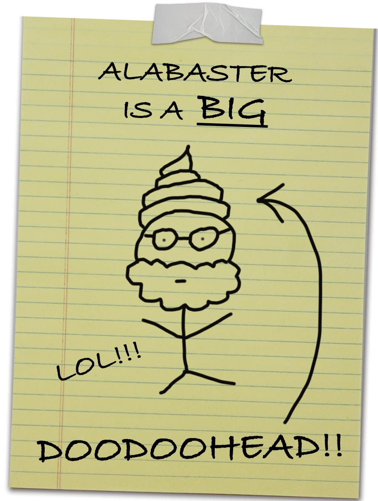

# Easter Eggs

## Seven Swans A Swanning
The Holiday Hack Challenges have been based on the 12 Days of Christmas song. This year should be
"Seven Swans A-Swimming", but doesn't appear to be. I assume it's a joke since Santa is "swanning
about" while the Elves get ready and then break out into war.

## Jason
As per usual, Jason is back. He could be found in Frosty Beach and makes a comment about being left
behind. When I went back to get a screenshot though, he appears to be gone so perhaps he wasn't left
behind after all?

## Elf Minder 9000
I assume this is a reference to the [It's Over 9000 meme](https://knowyourmeme.com/memes/its-over-9000)

## Drone Path
In Drone Path, Pigeon Lookalike and it's comments are a clear reference to the
[Bird's Aren't Real](https://knowyourmeme.com/memes/birds-arent-real) conspiracy theory.

## Hardware Hacking
In the code:
```
// console.log("PARTY TIME");
 const tryagainphrases = [
    	"Level incomplete! Keep playing!",
    	"Insert coin to continue your quest!",
    	"Continue? Time's running out!",
    	"You haven't beaten the high score yet!",
    	"Mission not accomplished! Retry?",
    	"Game over? Not yet, give it another shot!",
    	"The Force is not yet strong with this one.",
    	"You haven't completed your Jedi training.",
    	"Mission incomplete. The Rebellion still needs you.",
    	"The Death Star plans are still out of reach.",
    	"Your journey to the Dark Side is not over.",
    	"The Force is calling, but you haven't answered.",
    	"The Matrix still holds you, Neo.",
    	"You haven't broken free of the simulation yet.",
    	"Red pill taken, but the truth is not revealed.",
    	"The code is still incomplete. Keep hacking.",
    	"The Architect awaits your next move.",
    	"Reality is still an illusion. Persist.",
    	"Objective not complete. The city still needs you.",
    	"Neural link still active. Dive deeper.",
    	"Hack incomplete. Keep infiltrating.",
    	"You're still a ghost in the machine.",
    	"Cyber mission not finished. Keep running.",
    	"The grid still controls you. Break free.",
    	"Mission to Mars not yet completed.",
    	"Stardate update: Task unfinished.",
    	"You haven't reached the final frontier.",
    	"The galaxy awaits your return.",
    	"Your voyage is incomplete. Keep exploring.",
    	"Space mission still ongoing. Continue the adventure.",
    	"Mission not complete, soldier. Keep fighting!",
    	"You haven't saved the day yet.",
    	"The hero's journey is unfinished.",
    	"The battle is still raging. Don't give up.",
    	"You haven't defeated the villain yet.",
    	"Keep going, the action isn't over."
  	];
```
There's also a function called dad?

## Wombley?

I still don't know if Wombley's name is Wombly or Wombley? Both are used in the game, so either there's
dissent among the SANS team or it's because our previous writeups kept getting it wrong. As someone whose
name is frequently misspelt, I feel for Wombl(e)y 😂

## Images

The artwork this year was fantastic. Particularly this propaganda sign:


There are 12 gifs on the North Pole monitoring station (another reference to the 12 days of Christmas?)
which are all worth looking at.
