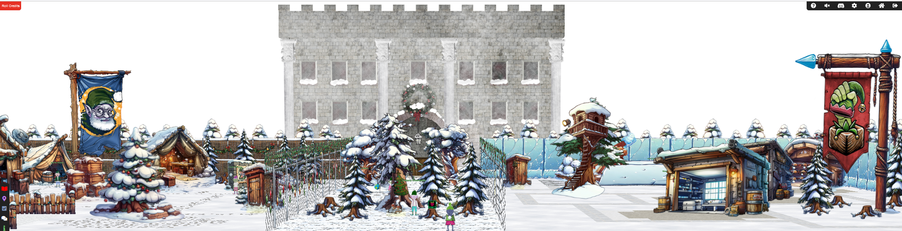
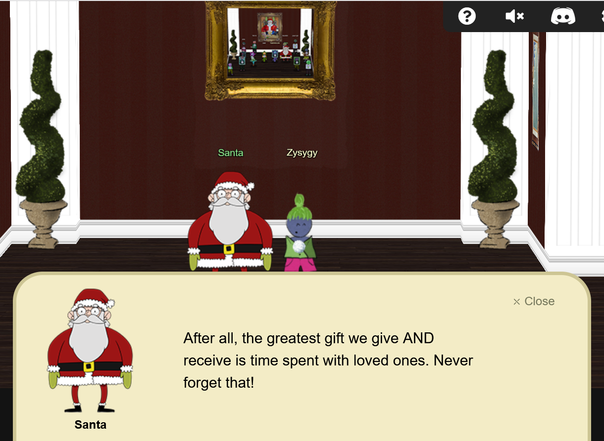

# Welcome

## Introduction

This year's Holiday Hack was very different:

* the event was split into a prologue, Act I, Act II and Act III
* most challenges had different difficulty levels in case you wanted an easier challenge
* there was no clear villain*
* [there is a public scoreboard](https://account.counterhack.com/user/Zysygy)

??? tip "Navigation tip"
    Even with less than 50 pages, there's still quite a bit of information to read through. To make things a little easier, you can use ++"P"++ or ++","++ to go to the previous section, ++"N"++ or ++"."++ to navigate to the next section, and ++"S"++, ++"F"++, or ++"/"++ to open up the search dialog.

    **TL;DR** if you keep pressing ++"N"++ or ++"."++ from this point forward, you'll hit all the content in the right order! :smile:

Some of my favourite challenges this year were [Santa Vision](./objectives/act_3/o11_santa_vision.md),
[Decrypt the Naughty-Nice List](./objectives/act_3/o13_decrypt.md) and [Mobile App Analysis](./objectives/act_2/o6_mobile.md). I also want to call out the [Drone Path](./objectives/act_2/o7_drone.md)
challenge for being the most impressive challenge, in my opinion, and 
[Deactivate the Naughty-Nice List](./objectives/act_3/o14_deactivate.md) for teaching me about yet
another technology that I didn't even know existed. 

### Prologue
We start the Holiday Hack back in Geese Islands, where we left off after the 2023 Holiday Hack.
The elves are busy packing up, but I guess a couple are slacking off and playing games.

!!! success "1. Elf Connect - :fontawesome-solid-star::fontawesome-regular-star::fontawesome-regular-star::fontawesome-regular-star::fontawesome-regular-star:"
    [Helped Angel Candysalt connect the dots in a game of connections.](./objectives/prologue/o1_elf_connect.md)

!!! success "2. Elf Minder 9000 - :fontawesome-solid-star::fontawesome-solid-star::fontawesome-regular-star::fontawesome-regular-star::fontawesome-regular-star:"
    [Assist Poinsettia McMittens with playing a game of Elf Minder 9000.](./objectives/prologue/o2_elf_minder.md)

### Act I
For Act I, we've gone back to the North Pole and the elves are busy unpacking and trying to get things
sorted for Santa's arrival. Some need our help with unlocking various tasks, while others are slacking
off and just want to play games with us. There appear to be a few cracks in the elves' organisational 
structure though.

!!! success "3. Frosty Keypad - :fontawesome-solid-star::fontawesome-regular-star::fontawesome-regular-star::fontawesome-regular-star::fontawesome-regular-star:"
    [In a swirl of shredded paper, lies the key. Can you unlock the shredder’s code and uncover Santa's lost secrets?](./objectives/act_1/o3_keypad.md)

!!! success "4. cURLing - :fontawesome-solid-star::fontawesome-regular-star::fontawesome-regular-star::fontawesome-regular-star::fontawesome-regular-star:"
    [Team up with Bow Ninecandle to send web requests from the command line using Curl, learning how to interact directly with web servers and retrieve information like a pro!](./objectives/act_1/o4_cURLing.md)

!!! success "5. Hardware Hacking 101 - :fontawesome-solid-star::fontawesome-regular-star::fontawesome-regular-star::fontawesome-regular-star::fontawesome-regular-star:"
    [Ready your tools and sharpen your wits—only the cleverest can untangle the wires and unlock Santa’s hidden secrets!](./objectives/act_1/o3_keypad.md)

### Act II
Full-blown war has broken out now, with the elves splitting into two factions behind either Wombley
or Alabaster. 
Wombley thinks Santa is taking Christmas in the wrong direction and is trying to recover the Naughty-
Nice list from Alabaster so that he can ensure Christmas runs properly whereas Alabaster is faithfully
following Santa's instructions and trying to keep the Naughty-Nice list safe from Wombley and anyone 
else who might try to steal it. Both factions want our help with their mission!

!!! success "6. Mobile Analysis - :fontawesome-solid-star::fontawesome-solid-star::fontawesome-regular-star::fontawesome-regular-star::fontawesome-regular-star:"
    [Help find who has been left out of the naughty AND nice list this Christmas. Please speak with Eve Snowshoes for more information.](./objectives/act_2/o6_mobile.md)

!!! success "7. Drone Path - :fontawesome-solid-star::fontawesome-solid-star::fontawesome-solid-star::fontawesome-regular-star::fontawesome-regular-star:"
    [Help the elf defecting from Team Wombley get invaluable, top secret intel to Team Alabaster. Find Chimney Scissorsticks, who is hiding inside the DMZ.](./objectives/act_2/o7_drone.md)

!!! success "8. PowerShell - :fontawesome-solid-star::fontawesome-solid-star::fontawesome-solid-star::fontawesome-regular-star::fontawesome-regular-star:"
    [Team Wombley is developing snow weapons in preparation for conflict, but they've been locked out by their own defenses. Help Piney with regaining access to the weapon operations terminal.](./objectives/act_2/o8_powershell.md)

!!! success "9. Snowball Showdown - :fontawesome-solid-star::fontawesome-solid-star::fontawesome-solid-star::fontawesome-regular-star::fontawesome-regular-star:"
    [Wombley has recruited many elves to his side for the great snowball fight we are about to wage. Please help us defeat him by hitting him with more snowballs than he does to us.](./objectives/act_2/o9_snowball.md)

!!! success "10. KC7 - :fontawesome-solid-star::fontawesome-solid-star::fontawesome-solid-star::fontawesome-regular-star::fontawesome-regular-star:"
    [Use logs to trace an unknown phishing attack targeting Alabaster’s faction.](./objectives/act_2/o10_kc7.md)

### Act III
Santa has returned and the war is over. Unfortunately, there's a lot of cleanup to do and the elves need
our help - we need to clean up the propaganda streams, determine what has happened in a compromised 
network and finally decrypt the Naughty-Nice List and deactivate the malware to prevent it from being 
published.

!!! success "11. Santa Vision - :fontawesome-solid-star::fontawesome-solid-star::fontawesome-solid-star::fontawesome-solid-star::fontawesome-regular-star:"
    [Alabaster and Wombley have poisoned the Santa Vision feeds! Knock them out to restore everyone back to their regularly scheduled programming.](./objectives/act_3/o11_santa_vision.md)

!!! success "12. Elf Stack - :fontawesome-solid-star::fontawesome-solid-star::fontawesome-solid-star::fontawesome-solid-star::fontawesome-solid-star:"
    [Help the ElfSOC analysts track down a malicious attack against the North Pole domain.](./objectives/act_3/o12_elf_stack.md)

!!! success "13. Decrypt the Naughty Nice List - :fontawesome-solid-star::fontawesome-solid-star::fontawesome-solid-star::fontawesome-solid-star::fontawesome-solid-star::fontawesome-solid-star:"
    [Decrypt the Frostbit-encrypted Naughty-Nice list and submit the first and last name of the child at number 440 in the Naughty-Nice list.](./objectives/act_3/o13_decrypt.md) here.

!!! success "14. Deactivate the Naughty Nice List - :fontawesome-solid-star::fontawesome-solid-star::fontawesome-solid-star::fontawesome-solid-star::fontawesome-solid-star::fontawesome-solid-star:"
    [Wombley's ransomware server is threatening to publish the Naughty-Nice list. Find a way to deactivate the publication of the Naughty-Nice list by the ransomware server.](./objectives/act_3/o14_deactivate.md) here.

## Conclusion

Another awesome year. Huge thanks to the SANS team for making such wonderful challenges, to 
devasti0n, BetaJ, Spiderman011, W3iRdKiD, NigelWittshire and to the rest of the Discord community
for their help in getting me unstuck on the more challenging challenges.

??? quote "Santa"
    I thought the holidays were truly lost this year. I am so thankful you were here to right the wrongs of my misguided elves. I will ensure they never jeopardize the holidays again. This is the kind of behavior I expect from Jack Frost and his Trolls, not the elves.

    But, I suppose I have fault in this as well, since it's the first time I've been away at the start of the season, and after last year's unconventional holidays.

    Plus, I didn't inform the elves ahead of time. Quite the lesson learned on my part. Even the best of us can always improve.

    I know each faction had the best interest of the holidays at heart, even if their methods were misguided. It's important to have empathy and forgiveness, especially during the holidays.

    After all, the greatest gift we give AND receive is time spent with loved ones. Never forget that!

    Now let's put all this behind us and be merry. Until next year! Happy Holidays!

??? "No clear villains"
    Some people would say Wombley is the villain and Alabaster is the protagonist. That's been true
    in past years, but I don't think we have enough evidence to say that this year.

