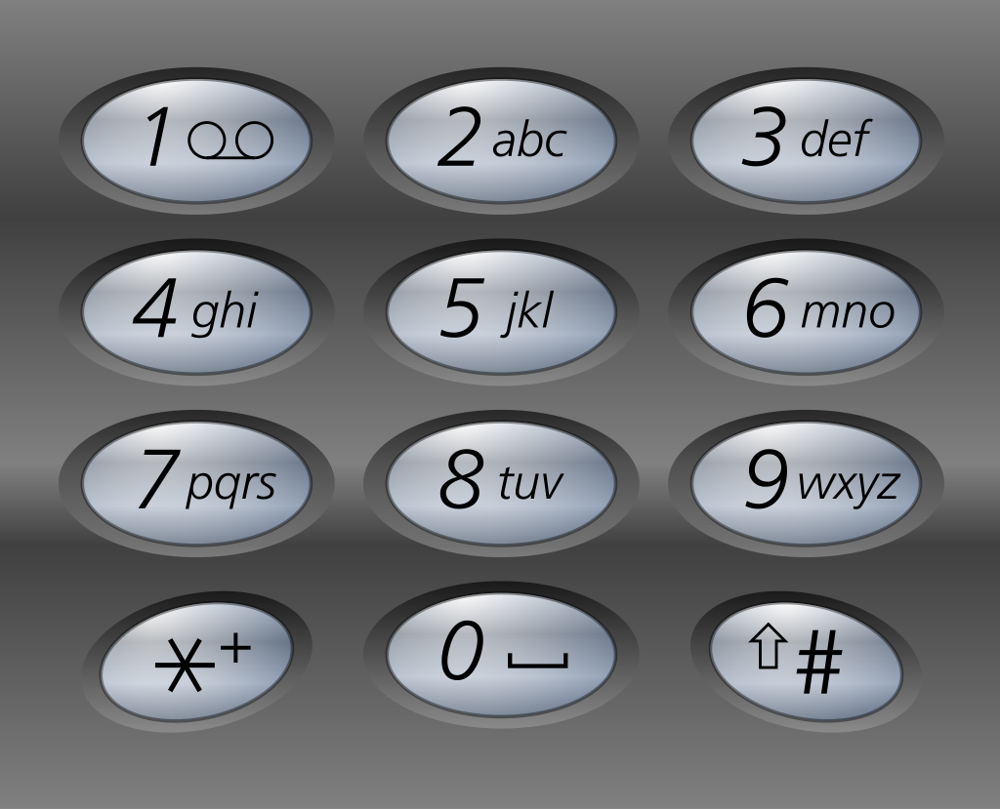

# Frosty Keypad

**Difficulty**: :fontawesome-solid-star::fontawesome-regular-star::fontawesome-regular-star::fontawesome-regular-star::fontawesome-regular-star: 
**Direct link**: [Objective 1 terminal](https://.../)

## Objective

!!! question "Request"
    In a swirl of shredded paper, lies the key. Can you unlock the shredder’s code and uncover Santa's lost secrets?

??? quote "Morcel Nougat"
    Hello again! I'm Morcel Nougat, dashing around like a reindeer on a sugar rush! We've got a bit of a dilemma, and I could really use your expertise.

    Wombley and Alabaster have taken charge now that Santa’s gone missing, and We're scrambling to get the Wish List secured. But... one of the elves in the Data Management Team got overzealous, and the Shredder McShreddin 9000 gobbled up a crucial document we need to access Santa's chest!

    It’s our golden ticket to getting Santa’s Little Helper tool working properly. Without it, the hardware hack we're planning is as empty as Santa’s sleigh in January.

    Think you can help? I can get you into the Shredder McShreddin 9000’s inner workings to retrieve the pieces, but there are two access codes involved. One of the elves left a hint, but it’s all a blur to me!

    I've noticed that some elves keep referring to a certain book when they walk by. I bet it has the answers we need to crack the code and recover the document!

    You know, some of the elves always have their noses in the same book when they pass by here. Maybe it’s got the clues we need to crack the code?

## Hints

??? tip "Who are you calling a dorf?"
    Hmmmm. I know I have seen Santa and the other elves use this keypad. I wonder what it contains. I bet whatever is in there is a National Treasure!

??? tip "Just some light reading"
    See if you can find a copy of that book everyone seems to be reading these days. I thought I saw somebody drop one close by...

??? tip "Shine some light on it"
    Well this is puzzling. I wonder if Santa has a seperate code. Bet that would cast some light on the problem. I know this is a stretch...but...what if you had one of those fancy UV lights to look at the fingerprints on the keypad? That might at least limit the possible digits being used...

## Solution

### Silver
Before solving this challenge, you need to explore the map in order to find the 
[Frosty Book](https://frost-y-book.com/).

Googling "National Treasure" leads us to 
[the film](https://en.wikipedia.org/wiki/National_Treasure_(film)) in which an 'Ottendorf cipher'
was used. If we assume the sticky tape's number:number:number pairs mean page:word:letter, then we
end up with the word 'santa'. 
In order to convert this to numbers, we can use the old cellphone buttons:

to convert it to the code:

!!! success "72682"

### Gold

Before solving this challenge, we need to find the UV light in the map. The UV light shows that
the only numbers touched were 2, 6, 7 and 8.

Since we know the pin is 5-characters long, there are 4^5 possibilities. 1024 is a bit too much
to do manually but won't take long with BurpSuite's intruder.

!!! success "22786"

## Response

!!! quote "Morcel Nougat"
    WOW, you did it! You know, they say Ottendorf ciphers were used back in the Frosty Archives crisis… or was that during the Jack Frost incident? Either way, you're amazing!

    But wait—there’s still one more code tucked away! This one might need a bit more elbow grease… you may need to try a few combinations to crack it!

    Unbelievable! You found a flaw in the system and completely bypassed the rate limiter. You’re practically an elf legend!

    Incredible work! You pieced together the code like a true sleuth and retrieved the shreds we need. I’m not quite sure how you’ll put them all together, but if anyone can, it’s you!

    Your help has been absolutely essential, especially now with Santa missing. Wombley and Alabaster will want to hear all about it—go share the news with Jewel Loggins!
