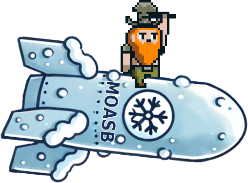
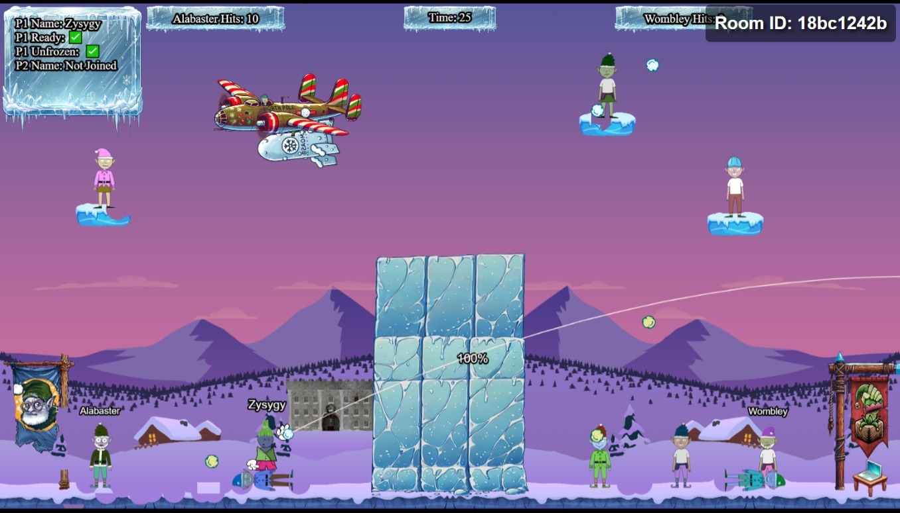

# Snowball Showdown

**Difficulty**: :fontawesome-solid-star::fontawesome-solid-star::fontawesome-regular-star::fontawesome-regular-star::fontawesome-regular-star: 

## Objective

!!! question "Request"
    Wombley has recruited many elves to his side for the great snowball fight we are about to wage. Please help us defeat him by hitting him with more snowballs than he does to us.

??? quote "Dusty Giftwrap"
    Hi there! I'm Dusty Giftwrap, back from the battlefield! I'm mostly here for the snowball fights!

    But I also don't want Santa angry at us, you wouldn't like him when he's angry. His face becomes as red as his hat! So I guess I'm rooting for Alabaster.

    Alabaster Snowball seems to be having quite a pickle with Wombley Cube. We need your wizardry.

    Take down Wombley the usual way with a friend, or try a different strategy by tweaking client-side values for an extra edge.

    Alternatively, we've got a secret weapon - a giant snow bomb - but we can't remember where we put it or how to launch it.

    Adjust the right elements and victory for Alabaster can be secured with more subtlety. Intriguing, right?

    Raring to go? Terrific! Here's a real brain tickler. Navigator of chaos or maestro of subtlety, which will you be? Either way, remember our objective: bring victory to Alabaster.

    Confidence! Wit! We've got what it takes. Team up with a friend or find a way to go solo - no matter how, let's end this conflict and take down Wombley!

## Solution

In theory, there's a number of different ways to solve this challenge:

* You could just join a team with someone who's cheating and get bronze.
* You could use the ice arch image to protect Alabaster and then play fairly
* You could DoS Wombley and his team by having a script autosend snowballs from him in the wrong
    direction so that the timeout stops him from sending real requests
* You could join Wombley's team, since he has more elves on his side.

However, I'm a big Firefox fan, and trying any of those options in Firefox's devtools while running
Snowball Showdown just caused my computer to hang, unfortunately.
So I assume they'd all be doable with Chrome... but I can't handle the UI of Chrome's devtools and
there's an even better solution anyway. We can summon Elf The Dwarf!

To achieve this, you just need to wait for the websocket to be connected and then run `this.moasb()`
in the console to summon a weapon of mass destruction (The Mother of All SnowBalls).

## Response

!!! quote "Dusty Giftwrap"
    Brilliant! You unravel the puzzle and launched the 'mother-of-all-snow-bombs' like a true mastermind. Wombley never saw it coming!

    Last year’s snowball fight taught us not to rely on client-side controls alone. Now, a server tracks every player action - no more sneaky moves! Let's just hope Alabaster didn't leave any client-side tricks for Wombley to exploit.

    Excellent! With Wombley’s forces defeated, they’ll have no choice but to admit defeat and abandon their wild plans to hijack Christmas.
