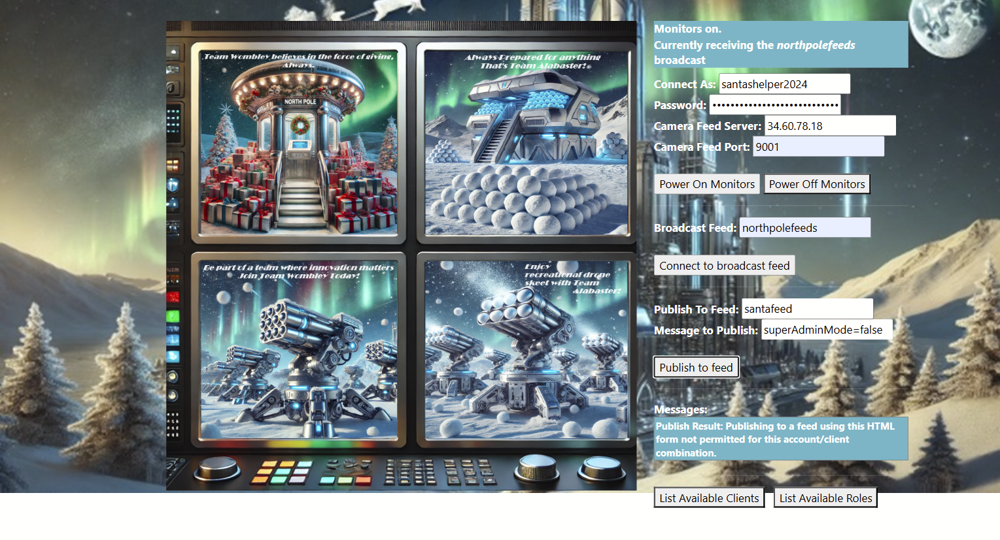

# Santa Vision

**Official Difficulty**: :fontawesome-solid-star::fontawesome-solid-star::fontawesome-solid-star::fontawesome-solid-star::fontawesome-solid-star:<br/>

**My Difficulty Rating**:
:fontawesome-solid-gift::fontawesome-solid-gift::fontawesome-solid-gift::fontawesome-solid-gift::fontawesome-regular-square:<br/>

## Objective

!!! question "Request"
    Alabaster and Wombley have poisoned the Santa Vision feeds! Knock them out to restore everyone back to their regularly scheduled programming.

??? quote "Ribb Bonbowford"
    Hi, Ribb Bonbowford here, ready to guide you through the SantaVision dilemma!

    The Santa Broadcast Network (SBN) has been hijacked by Wombley's goons—they're using it to spread propaganda and recruit elves! And Alabaster joined in out of necessity. Quite the predicament, isn't it?

    To access this challenge, use this terminal to access your own instance of the SantaVision infrastructure.

    Once it's done baking, you'll see an IP address that you'll need to scan for listening services.

    Our target is the technology behind the SBN. We need make a key change to its configuration.

    We've got to remove their ability to use their admin privileges. This is a delicate maneuver—are you ready?

    We need to change the application so that multiple administrators are not permitted. A misstep could cause major issues, so precision is key.

    Once that's done, positive, cooperative images will return to the broadcast. The holiday spirit must prevail!

    This means connecting to the network and pinpointing the right accounts. Don't worry, we'll get through this.

    Let's ensure the broadcast promotes unity among the elves. They deserve to see the season's spirit, don't you think?

    Remember, it's about cooperation and togetherness. Let's restore that and bring back the holiday cheer. Best of luck!

    The first step to unraveling this mess is gaining access to the SantaVision portal. You'll need the right credentials to slip through the front door—what username will get you in?

## Hints

??? tip "Filesystem Analysis"
    [jefferson](https://github.com/onekey-sec/jefferson/) is great for analyzing JFFS2 file systems.

??? tip "Misplaced Credentials"
    See if any credentials you find allow you to subscribe to any MQTT feeds.

??? tip "Database Pilfering"
    Consider checking any database files for credentials...

??? tip "Like a Good Header on Your HTTP?"
    Be on the lookout for strange HTTP headers...

??? tip "(my own) Silver is silver and Gold is gold"
    Don't try to use any of your gold answers for your silver challenges.

## Solution

!!! warning "Random"
    The IP address and numbers in the answers are randomly generated, so cannot
    be copy-pasted if trying to reproduce this.

### A: What username logs you into the SantaVision portal?

#### Silver
To start this challenge, we're simply given a site to spin up an IP address. So the first step is
to scan it to see what ports we can play with:

```
┌──(kali㉿kali)-[~]
└─$ nmap -sV 35.232.192.126                             	 
Starting Nmap 7.94SVN ( https://nmap.org ) at 2024-12-18 01:15 EST
Note: Host seems down. If it is really up, but blocking our ping probes, try -Pn
Nmap done: 1 IP address (0 hosts up) scanned in 3.52 seconds
                                                                        	 
┌──(kali㉿kali)-[~]
└─$ nmap -sV -Pn 35.232.192.126
Starting Nmap 7.94SVN ( https://nmap.org ) at 2024-12-18 01:15 EST
Stats: 0:02:14 elapsed; 0 hosts completed (1 up), 1 undergoing Service Scan
Service scan Timing: About 66.67% done; ETC: 01:19 (0:00:57 remaining)
Nmap scan report for 126.192.232.35.bc.googleusercontent.com (35.232.192.126)
Host is up (0.25s latency).
Not shown: 997 filtered tcp ports (no-response)
PORT 	STATE SERVICE 	VERSION
22/tcp   open  ssh     	OpenSSH 9.2p1 Debian 2+deb12u3 (protocol 2.0)
8000/tcp open  http-alt	gunicorn
9001/tcp open  tor-orport?

```
No UDP ports are open, and port 9001 was responding with an HTTP-like response but no
content.

??? tip "Dead ends"
    The SSH was a tempting target, but it requires public key authentication. I spent a
    while trying to figure out what 9001 was and wondered if it might be Mongodb due to the
    database hint, but couldn't make it work. I also tried running `dirb` against both ports
    to see if there were any interesting paths.

Visiting port 8000 shows a simple login page, but in HTML source code we can find the first answer:
`<!-- mqtt: elfanon:elfanon -->`

!!! success "elfanon"

#### Gold

The page also mentions `sitestatus`, and given the MQTT hint, we can assume port 9000 is listening to
MQTT and one of the topics is "sitestatus". After using the `elfanon` credentials to connect,
a message leads us to the following download: http://35.238.155.22:8000/static/sv-application-2024-SuperTopSecret-9265193/applicationDefault.bin

After installing jefferson, we can extract the server code to see that a Flask app is running. In
views.py, we find the following code:
```python
@accounts_bp.route("/sv2024DB-Santa/SantasTopSecretDB-2024-Z.sqlite", methods=["GET"])
def db():
    return send_from_directory("static", "sv2024DB-Santa/SantasTopSecretDB-2024-Z.sqlite", as_attachment=True)
```

Fortunately, this is also running in prod: 
http://35.238.155.22:8000/static/sv2024DB-Santa/SantasTopSecretDB-2024-Z.sqlite gives us the SQLite
database. We can simply open it in SQLite viewer to see the username and password are both stored in
plaintext.

!!! success "santaSiteAdmin"
    With password S4n+4sr3411yC00Lp455wd

### B: Once logged on, authenticate further without using Wombley's or Alabaster's accounts to see the northpolefeeds on the monitors. What username worked here?

#### Silver

With our elf-anon account, we have access to two functions `ListUsers` and `ListRoles`. If we simply
try to use the `elfmonitor` and `SiteElfMonitorRole` as username and password (setting the camera
feed server to our current IP and the port to 9001, as found in our earlier scan), we can successfully
turn on the cameras.

!!! success "elfmonitor"

#### Gold

When we login as the `santaSiteAdmin` user, the HTTP response includes the headers:
```
BrkrTopic: northpolefeeds
BrkrUser: santashelper2024
BrkrPswd: playerSantaHelperPass6057917780
```

Brkr probably means broker and refers to the MQTT "broker". We can confirm this works by using
that username and password combination, along with our IP and port 9001 to turn on the cameras.

!!! success "santashelper2024"

### C: Using the information available to you in the SantaVision platform, subscribe to the frostbitfeed MQTT topic. Are there any other feeds available? What is the code name for the elves' secret operation?

#### Silver

After turning on the cameras, we can subscribe to a feed. Northpole feeds just shows us Alabaster and
Wombley's propaganda pictures. Instead, we should subscribe to `frostbitfeeds`.

I found it easier to switch to a MQTT GUI rather than using the web interface (although you should be
able to do it with either). Then you can just subscribe to `#`, which means all feeds.

While watching `frostbitfeeds`, there's a comment about `santafeed`, which eventually publishes the
message "Sixteen elves launched operation: Idemcerybu"

!!! warning "Extra information"
    In frostbitfeeds, we see some interesting messages: 

    "Let's Encrypt cert for api.frostbit.app verified. at path /etc/nginx/certs/api.frostbit.app.key"

    and

    "Error msg: Unauthorized access attempt. /api/v1/frostbitadmin/bot/<botuuid>/deactivate, authHeader: X-API-Key, status: Invalid Key, alert: Warning, recipient: Wombley"

    Both led me on wild goose chases because they're not relevant to this challenge. They are relevant,
    though.

!!! success "Idemcerybu"

#### Gold

Taking the silver answer, *Sixteen* seems oddly specific. And the name isn't readable and also doesn't
look like any familiar encoding.

[Decode's cipher identifier](https://www.dcode.fr/cipher-identifier) was rather unhelpful, but prompting
AI eventually lead to the suggestion of trying a Caesar Cipher.
[Caesar cipher's](https://www.dcode.fr/caesar-cipher) can be brute-forced, and Idemcerybu shifted by 16
gives us our answer:

!!! success "Snowmobile"

### D: There are too many admins. Demote Wombley and Alabaster with a single MQTT message to correct the northpolefeeds feed. What type of contraption do you see Santa on?

#### Silver

While watching our MQTT feeds, we see a message about 'singleAdminMode' being disabled and 'superAdminMode' being enabled. Presumably we need to change one of these.

After logging in with our silver accounts from parts A and B, we're shown a form for publishing
messages. Publishing `singleAdminMode=true` gives us an error about not being allowed to publish
*to this feed* with the HTML form.

If we publish instead to `santafeed`, we get no error and the following message is published on
`northpolefeeds`:

??? quote "Images"
    ./static/images/hhc2024santatopsecreteasyimages376919542/santa376919542-1.png,./static/images/hhc2024santatopsecreteasyimages376919542/santa376919542-2.png,./static/images/hhc2024santatopsecreteasyimages376919542/santa376919542-3.png,./static/images/hhc2024santatopsecreteasyimages376919542/santa376919542-4.png,./static/images/hhc2024santatopsecreteasyimages376919542/santa376919542-5.png,./static/images/hhc2024santatopsecreteasyimages376919542/santa376919542-6.png,./static/images/hhc2024santatopsecreteasyimages376919542/santa376919542-7.png,./static/images/hhc2024santatopsecreteasyimages376919542/santa376919542-8.png

!!! success "pogo stick"
    These images show Santa riding a pogo stick

#### Gold

If we use our gold accounts from A and B, the HTML form isn't shown. We can manually remove
the CSS that hides it to show the form:



It's interesting that the error message specifically says we're not allowed to publish to the feed
*with this HTML form*. What if we don't use the HTML form, and instead run the JavaScript code directly:
```javascript
mqtt.send("santafeed", "singleAdminMode=true", 1, false)
```

That gives us another northpolefeeds message with the URL paths:

??? quote "Images"
    ./static/images/hhc2024santatopsecretimages835826406/santa835826406-1.png,./static/images/hhc2024santatopsecretimages835826406/santa835826406-2.png,./static/images/hhc2024santatopsecretimages835826406/santa835826406-3.png,./static/images/hhc2024santatopsecretimages835826406/santa835826406-4.png,./static/images/hhc2024santatopsecretimages835826406/santa835826406-5.png,./static/images/hhc2024santatopsecretimages835826406/santa835826406-6.png,./static/images/hhc2024santatopsecretimages835826406/santa835826406-7.png,./static/images/hhc2024santatopsecretimages835826406/santa835826406-8.png

!!! success "hovercraft"
    Now Santa is riding a hovercraft

## Response

!!! quote "Ribb Bonbowford"
    Great work! You've taken the first step—nicely done. You're on the silver path and off to a strong start!

    Impressive! You dug deeper and uncovered something hidden—very strategic work. You're well on your way to gold!

    You've gained access, but there's still much more to uncover. Patience and persistence will guide you—silver or gold, you're making progress!

    Now that you're in, it's time to go deeper. We need access to the northpolefeeds. This won't work if you use Wombley or Alabaster's credentials—find the right user to log in.

    (Silver hint) Trust your instincts. Even the smallest changes in code or headers could be your way forward.

    Wonderful job! You've uncovered a critical piece of the puzzle—well on track with the silver approach!

    (Gold hint) Sometimes the answers are in the quiet moments. Pay attention to every feed and signal—you may find what you're looking for hidden deep in the streams.

    You're almost there! The operation's code is unlocked, but the final challenge is waiting. Silver or gold, you're close to victory!

    It's time to take back control of the Santa Broadcast Network. There really shouldn't be multiple administrators—send the right message, and Santa's true spirit will return. What's Santa test-driving this season?

    Excellent! You've successfully removed the propaganda and restored the true spirit of the season. A solid silver finish—well done!

    (Gold hint) Think about the kind of ride Santa would take in a world filled with innovation. His vehicle of choice might surprise you—pay attention to the futuristic details.

    Phenomenal! You've figured it out—Santa's on a new ride. You've earned your gold badge with this one!

    Mission accomplished! The airwaves are restored, and the message is one of unity and teamwork. Whether silver or gold, you've done an incredible job!
