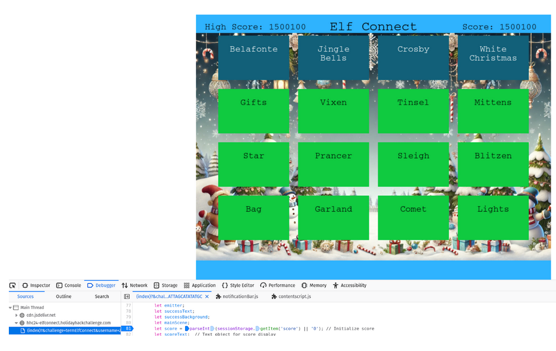

# Elf Connect

**Difficulty**: :fontawesome-solid-star::fontawesome-regular-star::fontawesome-regular-star::fontawesome-regular-star::fontawesome-regular-star:<br/>

## Objective

!!! question "Request"
    Help Angel Candysalt connect the dots in a game of connections.

??? quote "Angel Candysalt"
    Welcome back, island adventurer! I'm Angel Candysalt — so happy to finally meet you!

    I'm thrilled you're here because I could really use a hand with something.

    Have you ever heard of a game called Connections?

    It’s simple! All you need to do is find groups of four related words.

    I've been stuck on it all day, and I'm sure someone as sharp as you will breeze through it.

    Oh, and while you're at it, check out randomElf's score — they hit fifty thousand points, which seems… oddly suspicious.

    Think they might have tampered with the game? Just a hunch!

## Hints

??? tip "Elf Connect Easy"
    I love brain games! This one is like the New York Times Connections game. Your goal here is to find groups of items that share something in common. Think of each group as having a hidden connection or theme—four items belong together, and there are multiple groups to find! See if you can spot patterns or common threads to make connections. Group all the items correctly to win!

??? tip "Elf Connect Hard"
    WOW! A high score of 50,000 points! That’s way beyond the limit! With only four rounds and a max of 400 points per round, the top possible score should be 1,600 points. So, how did someone get to 50,000? Something unusual must be happening!

	If you're curious, you might want to check under the hood. Try opening the browser's developer tools console and looking around—there might even be a variable named 'score' that could give you some insights. Sometimes, games hold secrets for those who dig a little deeper. Give it a shot and see what you can discover!


## Solution

### Bronze / Silver

For bronze, we can presumably just solve the challenges like you would if this was a normal
game of Connections. I say "presumably" though, since I don't know enough Christmas-related
things to get through the first round!

Instead, we can look in the source code to find the answers:

```javascript
const wordSets = {
        	1: ["Tinsel", "Sleigh", "Belafonte", "Bag", "Comet", "Garland", "Jingle Bells", "Mittens", "Vixen", "Gifts", "Star", "Crosby", "White Christmas", "Prancer", "Lights", "Blitzen"],
        	2: ["Nmap", "burp", "Frida", "OWASP Zap", "Metasploit", "netcat", "Cycript", "Nikto", "Cobalt Strike", "wfuzz", "Wireshark", "AppMon", "apktool", "HAVOC", "Nessus", "Empire"],
        	3: ["AES", "WEP", "Symmetric", "WPA2", "Caesar", "RSA", "Asymmetric", "TKIP", "One-time Pad", "LEAP", "Blowfish", "hash", "hybrid", "Ottendorf", "3DES", "Scytale"],
        	4: ["IGMP", "TLS", "Ethernet", "SSL", "HTTP", "IPX", "PPP", "IPSec", "FTP", "SSH", "IP", "IEEE 802.11", "ARP", "SMTP", "ICMP", "DNS"]
    	};
...
    	let correctSets = [
        	[0, 5, 10, 14], // Set 1
        	[1, 3, 7, 9],   // Set 2
        	[2, 6, 11, 12], // Set 3
        	[4, 8, 13, 15]  // Set 4
    	];
```

That gives us the following answers:

| Round          	   |   Group       							| Connection                    |
| :------------------- | :------------------------------------- | :------------------------------ |
| One     			   | Tinsel, Garland,  Star, Lights        | Hung on a Christmas tree        |
| One      | Sleigh, Bag, Mittens, Gifts | Christmas items?          |
| One   | Belafonte, Jingle Bells, Crosby, White Christmas    | Christmas Songs      |
| One | Comet, Vixen, Prancer, Blitzen    | Reindeer |
|       |      |       |
|  Two     |  Nmap, netcat, wireshark, nessus    |   internet protocol-based tools?    |
|  Two     |  burp, owasp zap, nikto, wfuzz   |  web fuzzers    |
|  Two     |  frida, cycript, appmon, apktool   |  mobile app RE tools    |
|  Two     |  metasploit, cobalt strike, havoc, empire   |  full exploit chain tools?    |
|       |     |      |
|  Three     |  Aes, rsa, blowfish, 3des   |   hashing protocols   |
|  Three     |  wep, wpa2, tkip, leap   |   LAN protocols   |
|  Three     |  symmetric, asymmetric, hash, hybrid   |  encryption types    |
|  Three     |  caesar, one-time-pad, ottendorf, scytale   |  cypher tools    |
|       |     |      |
|  Four     |  IGMP, IPX, IP, ICMP   |  Internet-Protocols    |
|  Four     |  TLS, SSL, IPSec, SSH   |   Security protocols   |
|  Four     |  Ethernet, PPP, IEEE 802.11, ARP   |  LAN protocols    |
|  Four     |  HTTP, FTP, SMTP, DNS   |  Application protocols    |


### Gold

For gold, we need to get a score over 50,000. To do so, we can simply notice this line in
the JavaScript code:
`let score = parseInt(sessionStorage.getItem('score') || '0'); // Initialize score`
and update the 'score' either in the JavaScript (and then complete a round) or in our session storage.



## Response

!!! quote "Angel Candysalt"
    Amazing! You really connected all the dots like a pro.

And guess what? You bumped randomElf off the leaderboard!

Now, how about trying the game again — this time without any tampering or hacking.
