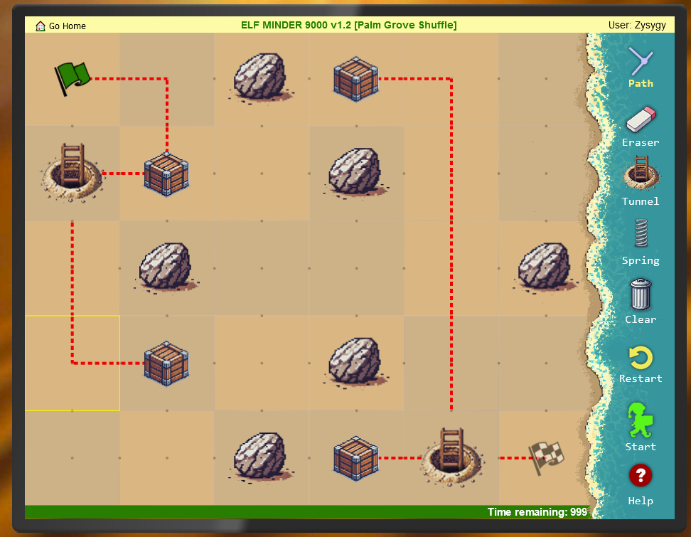

# Elf Minder

**Difficulty**: :fontawesome-solid-star::fontawesome-regular-star::fontawesome-regular-star::fontawesome-regular-star::fontawesome-regular-star:<br/>
**Direct link**: [Objective 1 terminal](https://.../)

## Objective

!!! question "Request"
    Assist Poinsettia McMittens with playing a game of Elf Minder 9000.

??? quote "Poinsetta McMittens"
    Center your mind, and become one with the island!

    Relax...

    This isn't working! I'm trying to play this game but the whole "moving back to the North Pole" thing completely threw me off.

    Say, how about you give it a try. It's really simple. All you need to do is help the elf get to the exit.

    The faster you get there, the better your score!

    I've run into some weirdness with the springs though. If I had created this game it would've been a lot more stable, but I won't comment on that any further.

    The rest of these elves are like corporate zombos. They just run around in circles unless you give them some direction.

## Hints

??? tip "RTD (Read the Docs)"
    Be sure you read the "Help" section thoroughly! In doing so, you will learn how to use the tools necessary to safely guide your elf and collect all the crates.

??? tip "Reusable Paths"
    Some levels will require you to click and rotate paths in order for your elf to collect all the crates.

??? tip "TODO"
    When developing a video game—even a simple one—it's surprisingly easy to overlook an edge case in the game logic, which can lead to unexpected behavior.

## Solution

For bronze, you can simply solve the game (and it's pretty fun, so why not). The last level, however,
isn't possible to complete manually.



For gold, we have to open the developer tools and look at the JavaScript that's running. A couple of 
things stand out:
```javascript
if (isEditor) {
    adminControls.classList.remove('hidden');
    console.log('⚡⚡⚡⚡⚡⚡⚡⚡⚡⚡⚡⚡⚡⚡⚡');
    console.log('⚡ Hey, I noticed you are in edit mode! Awesome!');
    console.log('⚡ Use the tools to create your own level.');
    console.log('⚡ Level data is saved to a variable called `game.entities`.');
    console.log('⚡ I\'d love to check out your level--');
    console.log('⚡ Email `JSON.stringify(game.entities)` to evan@counterhack.com');
    console.log('⚡⚡⚡⚡⚡⚡⚡⚡⚡⚡⚡⚡⚡⚡⚡');
}
```

While interesting (and hopefully well used), editor mode doesn't help us win gold.
```javascript
 localStorage.setItem(`level_${levelNum}`, JSON.stringify({
            segments: game.segments,
            entities: game.entities.filter(entity => ~[EntityTypes.SPRING, EntityTypes.PORTAL].indexOf(entity[2])),
        }));

        if (game.hasStartSegments()) {
            startBtn.classList.add('ready');
        }  else {
            startBtn.classList.remove('ready');
        }
```
suggests we might want to look in the local storage.
Everything is stored in plaintext without any validation so we can simply update the level `level_A Real Pickle`:

```
{"segments":[[[10,9], [11,9]],[[1,1],[2,1]],[[2,1],[3,1]],[[7,1],[8,1]],[[8,1],[9,1]],[[9,1],[9,2]],[[9,2],[9,3]],[[9,3],[8,3]],[[6,3],[5,3]],[[5,3],[5,4]],[[5,4],[5,5]],[[5,5],[4,5]],[[4,5],[3,5]],[[3,5],[3,6]],[[3,6],[3,7]],[[3,7],[4,7]],[[4,7],[5,7]],[[5,7],[6,7]],[[6,7],[7,7]],[[7,7],[8,7]],[[8,7],[9,7]],[[9,7],[10,7]]],"entities":[[3,1,6],[7,1,6],[8,3,7],[10,7,7],[9,7,7]]}
```


## Response

!!! quote "Poinsetta McMittens"
        
    Way to pass them some of your super centered energy. Better you than me, though. I'd let them walk themselves straight off the island.

    You took the easy win, it seems we're kindred spirits. But there's also a hard way to solve this challenge.

    The more segments you use, the higher the reward. But who actually wants life to be more difficult?

